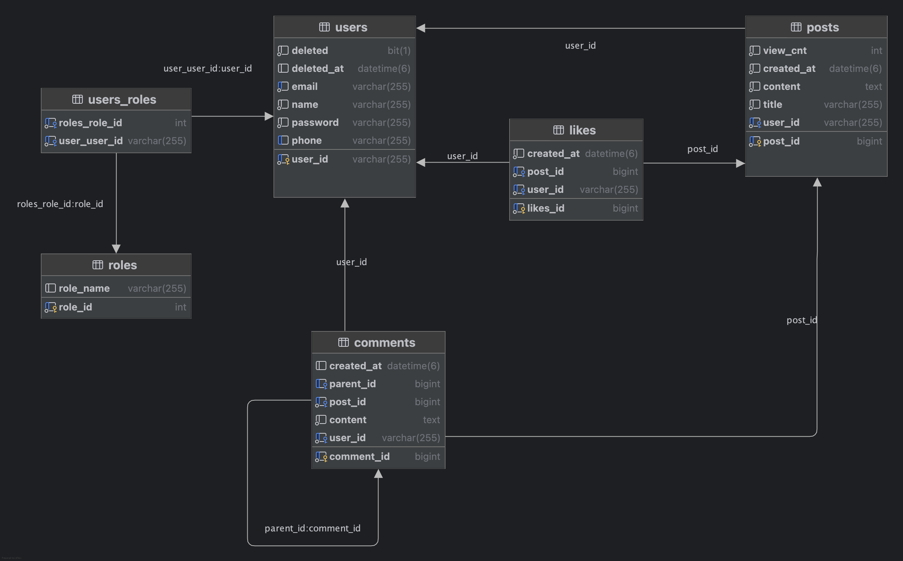
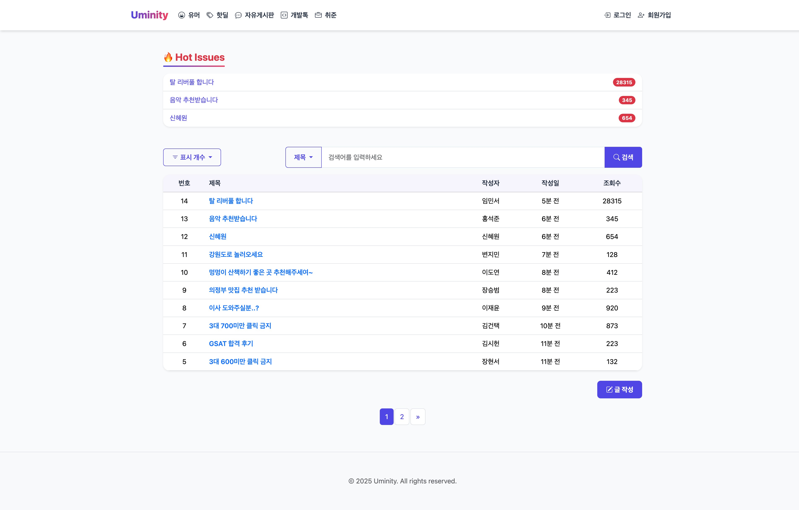
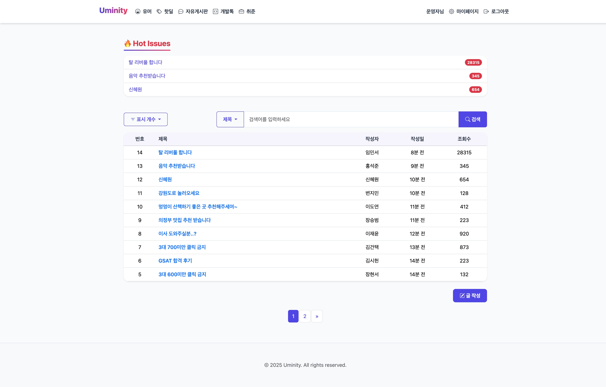
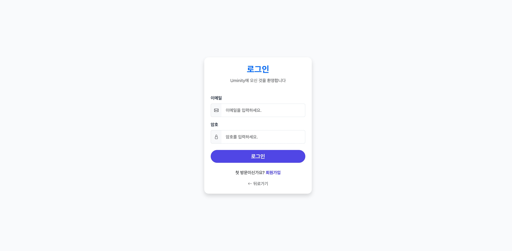
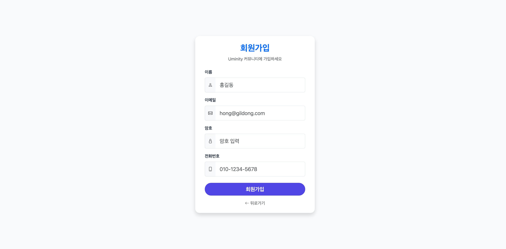
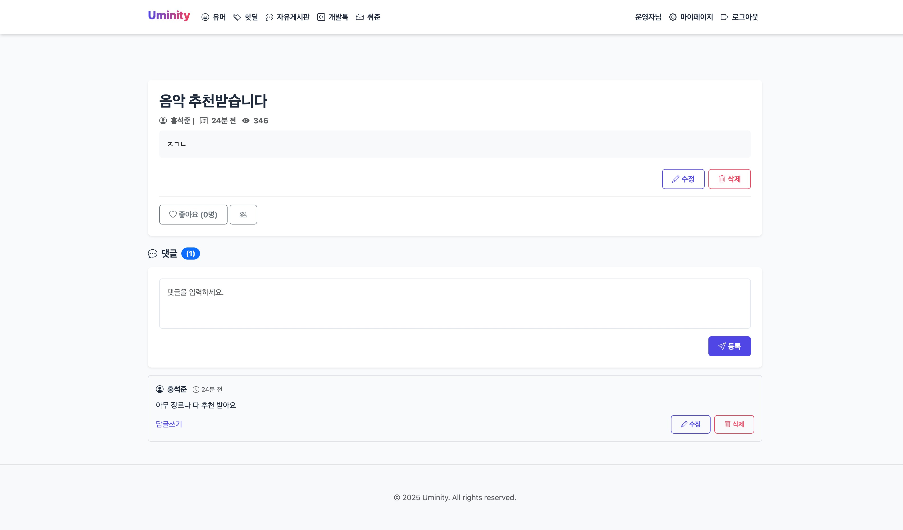
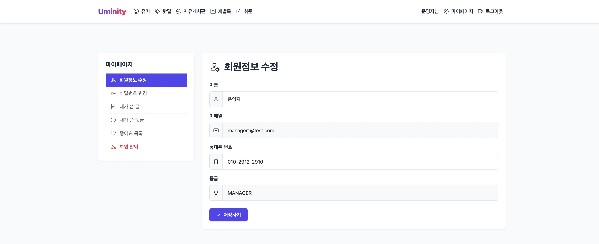

# 🌟 Uminity (유레카 커뮤니티)

  

---

## 📖 프로젝트 개요

- Spring Boot 기반 웹 커뮤니티 플랫폼
- 사용자간 소통 및 정보 공유를 목적으로 개발되었음
- 로그인, 회원가입, 마이페이지, 게시글 등록, 댓글 등록, 좋아요 기능 등을 제공
- Spring Security를 통한 인증 관리

---

## 🎯 Index

1. [팀원](#팀원)
2. [주요 기능](#주요-기능)
3. [기술 스택](#기술-스택)
4. [ERD](#erd)
5. [시연 화면](#시연-화면)

---

## 👥 팀원

| 이름  | 역할       | 주요 구현 내용                           | GitHub                                                                                                                                                         |
|-----|----------|------------------------------------|----------------------------------------------------------------------------------------------------------------------------------------------------------------|
| 이희용 | 백엔드 (팀장) | 로그인, 회원가입, 마이페이지                   |  |
| 김지산 | 백엔드 (팀원) | 게시글 CRUD, 페이지네이션, 댓글/대댓글, 좋아요, 조회수 |        |
| 정동현 | 백엔드 (팀원) | 게시글 CRUD, 페이지네이션, 좋아요, 조회수, 테스트 코드 |   |
|

---

## 🚀 주요 기능

* **회원가입 & 로그인**
* **마이페이지**

    * 회원정보 수정
    * 내가 쓴 글/댓글 조회
    * 좋아요한 게시글 조회
    * 회원 탈퇴
* 제목, 제목 + 내용, 내용 검색
* **게시글 관리**: 작성, 수정, 삭제, 목록 조회
* **댓글 관리**: 작성, 수정, 삭제
* **좋아요 기능**
* **역할 관리**: `User`, `Manager` 권한 구분 및 제한

---

## 🛠️ 기술 스택

- Spring Boot
- Spring Security
- Spring Data JPA
- MySQL
- Lombok
- Gradle
- JUnit, Mockito

---

## 🗂️ ERD

---

## 🎥 시연 화면

|              로그인 전 메인              |             로그인 후 메인             |           로그인 페이지           |
|:----------------------------------:|:--------------------------------:|:---------------------------:|
|  |  |  |

|             회원가입 페이지              |              게시글 상세               |             마이페이지             |
|:---------------------------------:|:---------------------------------:|:-----------------------------:|
|  |  |  |

---